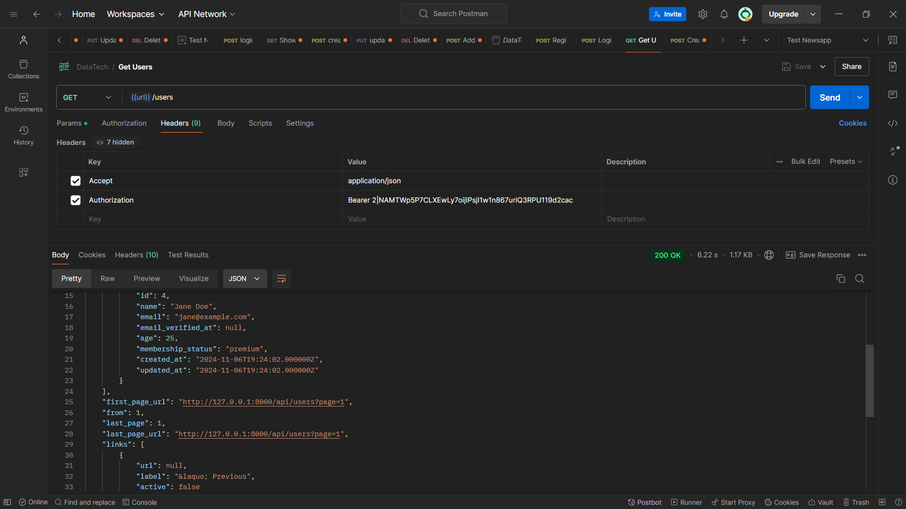
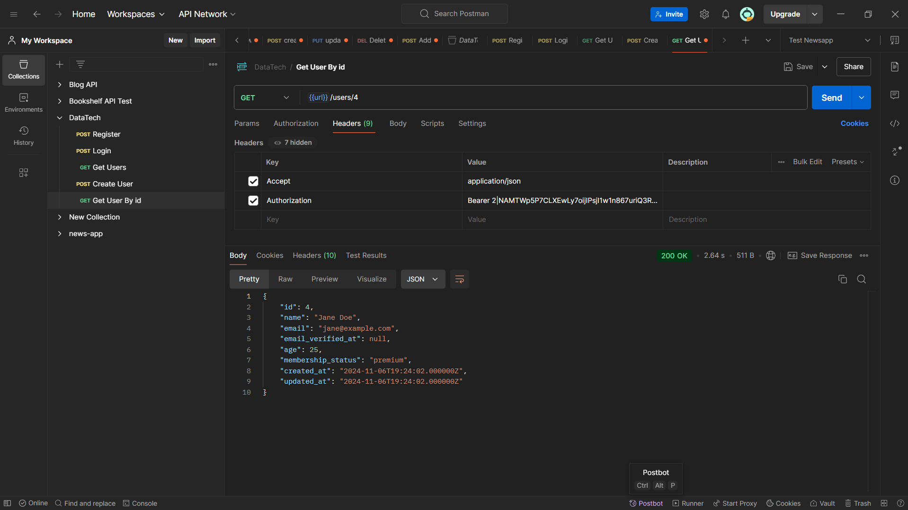
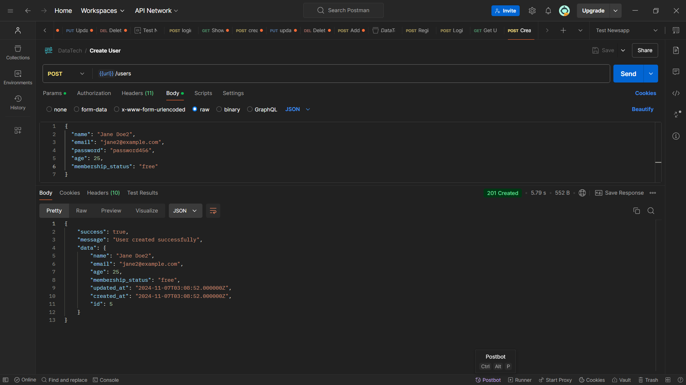
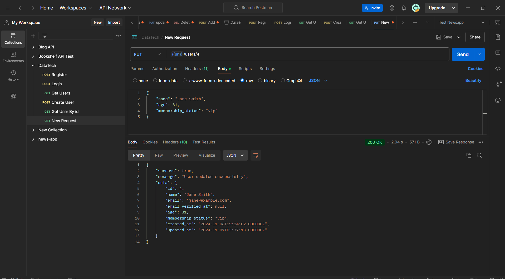
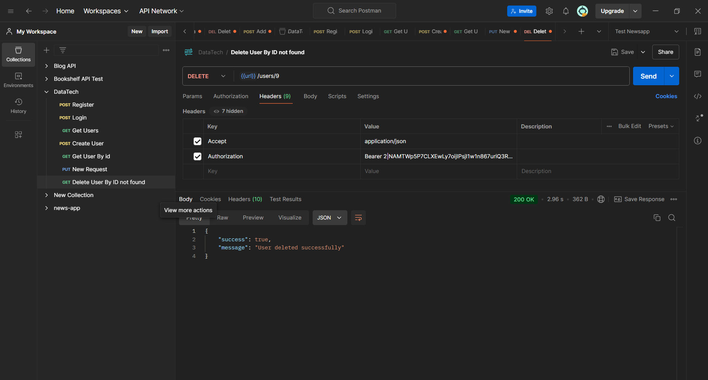
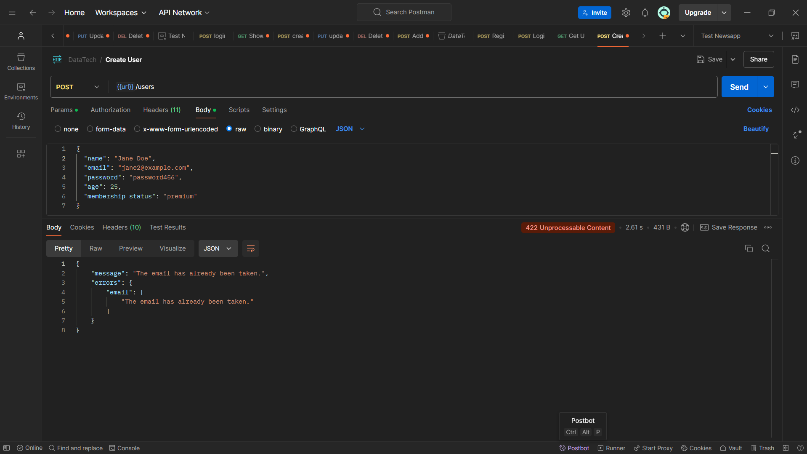
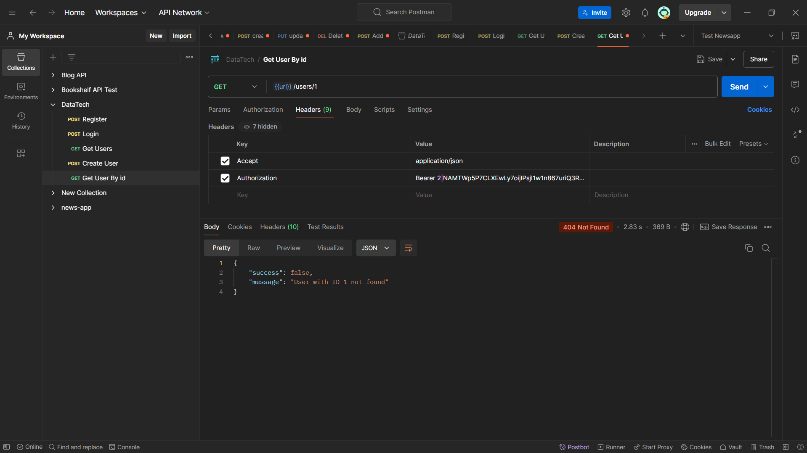
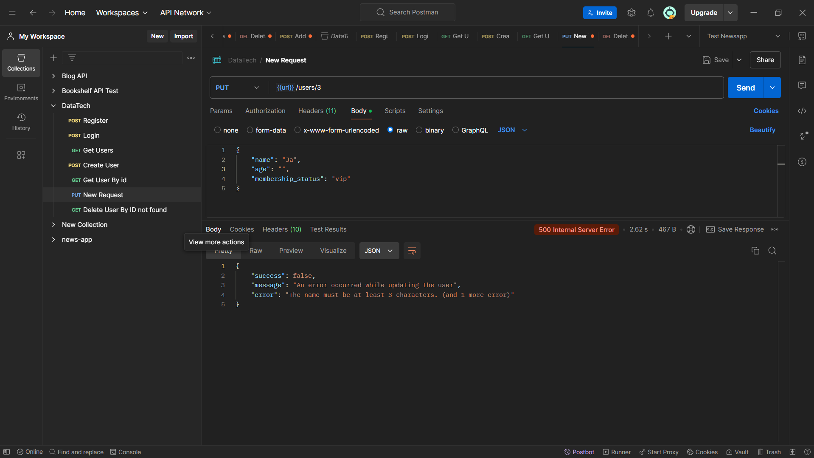
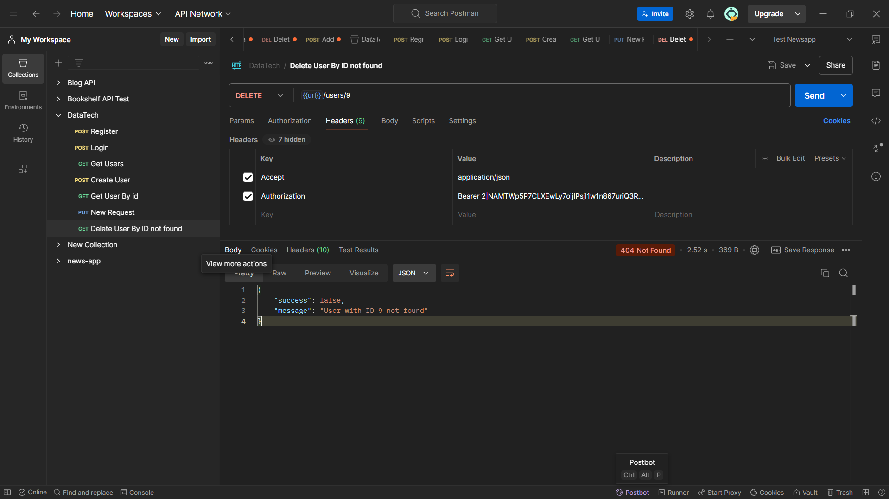

# User Management API Documentation

## Table of Contents
- [Overview](#overview)
- [Features](#features)
- [API Endpoints](#api-endpoints)
  - [Authentication](#authentication)
    - [Register User](#register-user)
    - [Login User](#login-user)
  - [User Management](#user-management)
    - [Get All Users](#get-all-users)
    - [Get Single User](#get-single-user)
    - [Create User](#create-user)
    - [Update User](#update-user)
    - [Delete User](#delete-user)
- [Frontend Implementation](#frontend-implementation-example)
  - [UserService.js](#userservicejs)
  - [React Component](#react-component-example)
- [Error Handling](#error-handling)
- [Security Considerations](#security-considerations)
- [Installation & Setup](#installation--setup)
- [Contributing](#contributing)
- [License](#license)

## Overview
Ini adalah RESTful API untuk manajemen pengguna yang dibangun dengan Laravel dan Laravel Sanctum untuk otentikasi. API menyediakan titik akhir untuk registrasi pengguna, autentikasi, dan operasi CRUD pada data pengguna.

## Features
- Pendaftaran pengguna dan otentikasi menggunakan token JWT
- Operasi CRUD untuk manajemen pengguna
- Status keanggotaan berbasis peran (gratis, premium, vip)
- Input validation
- Pagination untuk daftar pengguna
- Rute dilindungi menggunakan Laravel Sanctum


## API Endpoints

### Authentication

#### Register User
```http
POST /api/register
```
Request body:
```json
{
    "name": "John Doe",
    "email": "john@example.com",
    "password": "password123",
    "age": 25,
    "membership_status": "free"  // free, premium, or vip
}
```
Response:
```json
{
    "access_token": "1|whatever-random-token",
    "token_type": "Bearer"
}
```

#### Login User
```http
POST /api/login
```
Request body:
```json
{
    "email": "john@example.com",
    "password": "password123"
}
```
Response:
```json
{
    "access_token": "1|whatever-random-token",
    "token_type": "Bearer"
}
```

### User Management
Semua titik akhir ini memerlukan otentikasi. Sertakan token di header Otorisasi:
```
Authorization: Bearer <your-token>
```


#### Get All Users
```http
GET /api/users
```
Response:
```json
{
    "current_page": 1,
    "data": [
        {
            "id": 1,
            "name": "John Doe",
            "email": "john@example.com",
            "age": 25,
            "membership_status": "free",
            "created_at": "2024-01-01T00:00:00.000000Z",
            "updated_at": "2024-01-01T00:00:00.000000Z"
        }
    ],
    "first_page_url": "http://localhost:8000/api/users?page=1",
    "from": 1,
    "last_page": 1,
    "per_page": 20,
    "total": 1
}
```


#### Get Single User
```http
GET /api/users/{id}
```
Response:
```json
{
    "id": 1,
    "name": "John Doe",
    "email": "john@example.com",
    "age": 25,
    "membership_status": "free",
    "created_at": "2024-01-01T00:00:00.000000Z",
    "updated_at": "2024-01-01T00:00:00.000000Z"
}
```


#### Create User
```http
POST /api/users
```
Request body:
```json
{
    "name": "Jane Doe",
    "email": "jane@example.com",
    "password": "password123",
    "age": 30,
    "membership_status": "premium"
}
```


#### Update User
```http
PUT /api/users/{id}
```
Request body:
```json
{
    "name": "Jane Smith",
    "age": 31,
    "membership_status": "vip"
}
```


#### Delete User
```http
DELETE /api/users/{id}
```


## Frontend Implementation Example

### UserService.js
```javascript
import axios from 'axios';

const API_URL = 'http://localhost:8000/api';

const axiosInstance = axios.create({
    baseURL: API_URL,
    headers: {
        'Content-Type': 'application/json'
    }
});

// Add token to requests if available
axiosInstance.interceptors.request.use((config) => {
    const token = localStorage.getItem('token');
    if (token) {
        config.headers.Authorization = `Bearer ${token}`;
    }
    return config;
});

export const login = async (email, password) => {
    try {
        const response = await axiosInstance.post('/login', { email, password });
        localStorage.setItem('token', response.data.access_token);
        return response.data;
    } catch (error) {
        throw error.response.data;
    }
};

export const register = async (userData) => {
    try {
        const response = await axiosInstance.post('/register', userData);
        localStorage.setItem('token', response.data.access_token);
        return response.data;
    } catch (error) {
        throw error.response.data;
    }
};

export const getUsers = async (page = 1) => {
    try {
        const response = await axiosInstance.get(`/users?page=${page}`);
        return response.data;
    } catch (error) {
        throw error.response.data;
    }
};
```

### React Component Example
```javascript
import React, { useState, useEffect } from 'react';
import { getUsers, login, register } from './UserService';

function UserManagement() {
    const [users, setUsers] = useState([]);
    const [loading, setLoading] = useState(false);
    const [error, setError] = useState(null);

    useEffect(() => {
        fetchUsers();
    }, []);

    const fetchUsers = async () => {
        try {
            setLoading(true);
            const data = await getUsers();
            setUsers(data.data);
        } catch (err) {
            setError(err.message);
        } finally {
            setLoading(false);
        }
    };

    const handleLogin = async (e) => {
        e.preventDefault();
        try {
            const response = await login('example@email.com', 'password123');
            console.log('Logged in:', response);
            // Handle successful login (e.g., redirect, update state)
        } catch (err) {
            setError(err.message);
        }
    };

    const handleRegister = async (userData) => {
        try {
            const response = await register(userData);
            console.log('Registered:', response);
            // Handle successful registration
        } catch (err) {
            setError(err.message);
        }
    };

    if (loading) return Loading...;
    if (error) return Error: {error};

    return (
        
            User Management
            
                {users.map(user => (
                    
                        {user.name}
                        Email: {user.email}
                        Age: {user.age}
                        Membership: {user.membership_status}
                    
                ))}
            
        
    );
}

export default UserManagement;
```

## Error Handling

# 1 Error Handling Create User
- Email tidak sesuai


- User dengan email sama sudah ada


- password kurang dari 8 karakter


# 2 Error Handling Get User By ID
- ID tidak tersedia


# 3 Error Handling Update User
- ID Not Found

- Name kurang dari 3 karakter


# 4 Error Handling Delete User ID Not Found



The API returns appropriate HTTP status codes:

- 200: Success
- 201: Created
- 400: Bad Request
- 401: Unauthorized
- 404: Not Found
- 422: Validation Error
- 500: Server Error

Error responses include a message explaining what went wrong:
```json
{
    "message": "The given data was invalid.",
    "errors": {
        "email": ["The email has already been taken."]
    }
}
```

## Installation & Setup

1. Clone the repository:
```bash
git clone https://github.com/siihasann/api-datatech-crud.git

cd user-management-api
```

2. Install dependencies:
```bash
composer install
```

3. Copy .env.example to .env and configure your database:
```bash
cp .env.example .env
```

4. Generate application key:
```bash
php artisan key:generate
```

5. Run migrations:
```bash
php artisan migrate
```

6. Start the development server:
```bash
php artisan serve
```

## And View My RestAPi BLOG-APP
https://github.com/siihasann/restapi-blogapp

## Dependency

- PHP >= 8.0
- Laravel Framework >= 9.0
- Livewire
- Tailwind CSS
- Laravel Sanctum
- Laravel Breze

## Security Considerations

- Semua kata sandi di-hash menggunakan bcrypt
- Rute API dilindungi dengan Laravel Sanctum
- CORS dikonfigurasi untuk akses frontend
- Pembatasan tarif diterapkan untuk mencegah penyalahgunaan

## Contributing
Please read the contributing guide before submitting pull requests.

## License
This project is licensed under the MIT License.